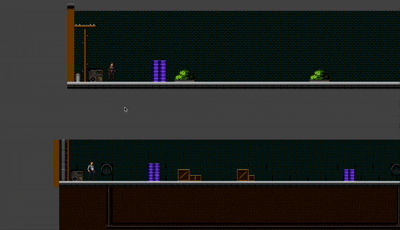

# Cash Crew: Game Design Document

## [Cash Crew](https://datta2907.github.io/cash-crew/)
  
## Vision Statement
Deliver cash to the mafia boss while dodging thieves and obstacles in a fast-paced multiplayer delivery game. Players must cooperate and react quickly to survive and earn maximum cash.

## Gameplay
Players control two delivery agents in a POV running view along a road. One player can **jump**, while the other can **crawl**, and together they must avoid obstacles and thieves. The game is designed for **cooperative multiplayer**, requiring coordination and timing.

### Mechanics
- Players must **jump over or crawl under obstacles** depending on their assigned ability.  
- **Cash collection**: Players lose cash each time they get hit by an obstacle.  
- **Direct-kill obstacles**: Some obstacles instantly eliminate the player.  
- **Cooperation**: Players must communicate and time their movements to survive sequences of obstacles.  
- Core mechanics are **jumping, crawling, dodging, and timing**, repeated across each section of the road.

### Scoring and/or Win / Lose Conditions
- Players **win** if they reach the end of the road with enough cash to satisfy the mafia boss.  
- Players **lose** if they lose too much cash or hit a direct-kill obstacle.  
- Performance is measured by **final cash collected** and number of obstacles successfully navigated.

### Controls
- **Player 1**: Jump using a single key (e.g., Space).  
- **Player 2**: Crawl using a single key (e.g., Ctrl or Down arrow).  
- Multiplayer input may be local or networked, with each player controlling one character.

### Aesthetic
- Urban, gritty road environment at night with neon signs and city details.  
- Obstacles visually resemble thieves, roadblocks, barrels, and moving hazards.  
- POV perspective keeps the player immersed in the running action.

### Desired Player Experience
- **Excitement and tension** as players dodge obstacles in real-time.  
- **Cooperative engagement** where timing and communication determine success.  
- **Satisfaction** from surviving sequences and earning cash.

## Game Characters
- **Player Characters (PCs)**:  
  - Delivery Agent 1 (jumping)  
  - Delivery Agent 2 (crawling)  
- **Non-Player Characters (NPCs)**:  
  - Thieves attempting to steal cash  
  - Mafia boss (at the end to judge cash earned)  
  - Random obstacles (barrels, roadblocks)

## Story
Two delivery agents are tasked to deliver cash to a mafia boss. On the way, thieves and obstacles try to stop them. Players must coordinate and avoid losing cash, surviving all obstacles to successfully complete the delivery and earn the boss’s approval.

## The Game World
- **Key Locations**: Urban streets, alleyways, underpasses.  
- **Maps**: Linear running track with obstacle sequences and occasional branching shortcuts.  
- **Scale**: Medium-scale POV road, enough to see incoming obstacles.  
- **Weather / Time**: Nighttime city environment; optional rain for difficulty.  
- **Society / Culture**: Mafia-controlled urban underworld, street hazards, criminal-themed NPCs.

## Media List
- **Character Art**: Stylized agents, thieves, and mafia boss.  
- **Animations**: Running, jumping, crawling, obstacle impact, cash loss effect.  
- **World Art**: Road environment, neon lights, city details, obstacles.  
- **Music and Sound Effects**: Tense chase music, collision sounds, cash collection jingles, boss approval sound at the end.

### Also needed:
- **Character Art**: Yes  
- **Animations**: Yes  
- **World Art**: Yes  
- **Music and Sound Effects**: Yes
